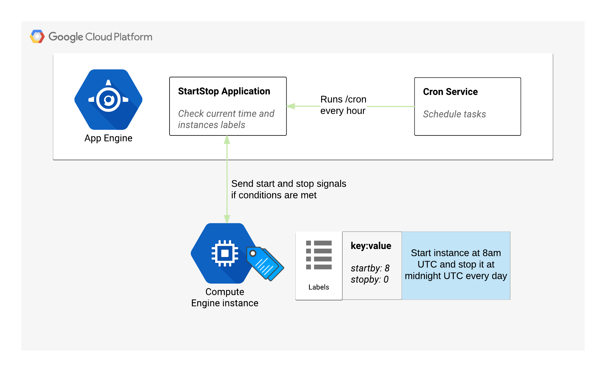

## Google Cloud Platform - Schedule Start/Stop of instances

### In a few words
This repository contains a Google App Engine application that can schedule start and stop operations on your GCP instances through the use of labels.

### Architecture



### How to deploy
- Make sure you have gcloud tool installed on your computer https://cloud.google.com/sdk/
- Make sure you have access to the Google Cloud Platform project where you want to deploy this tool
- Place yourself in this code repository and run the following below:
```
virtualenv env
source env/bin/activate
pip install -t lib -r requirements.txt
deactivate
gcloud app deploy app.yaml --project <my project id>
gcloud app deploy cron.yaml --project <my project id>
```
- Add following permission at organization level to the service account associated with Google App Engine (can be found under IAM > Service accounts > App Engine app default service account):
```
compute.instances.list
compute.instances.get
compute.instances.start
compute.instances.stop
resourcemanager.projects.get
resourcemanager.projects.list
```

### Accepted labels on instances

- Simple start and stop example:
```
startby: 8
stopby: 0
=> Start instance at 8AM UTC and stop it at midnight UTC every day.
```
- Run only on working days (Monday to Friday):
```
stopby: 0d
startby: 8d
=> Stop instance at midnight UTC and start it at 8AM UTC from Monday to Friday
```

- Run only on weekends (Saturday and Sunday):
```
startby: 18w
stopby: 14w
=> Start instance at 2pm UTC and stop it at 6pm UTC from Saturday to Sunday
```

- Run only a stop, for example if an instance is for a developer.
When he comes in the morning he can start his instance manually when needed:
```
stopby: 18d
=> Stop an instance at 6pm UTC every day of the working week
```

### Interface
- Show the status of the application and instances discovered by the application

https://myappendpoint.appspot.com/status
- Force or test the start and stop actions instead of waiting for the cron job

https://myappendpoint.appspot.com/cron

### Author

Paul Chapotet — paul@chapotet.com
